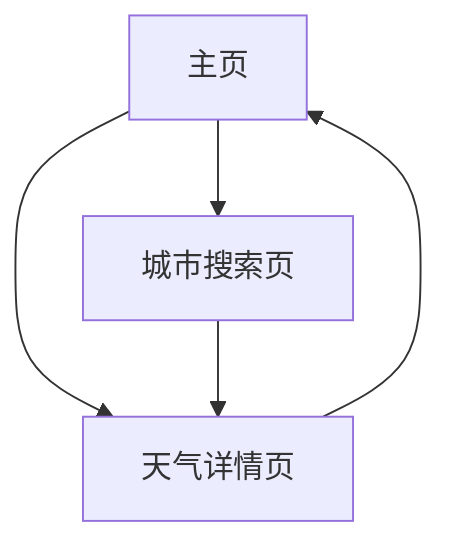

## 1. Product Overview

动态天气应用，通过精美的动画效果展示实时天气信息，用户可搜索任意城市获取天气数据。
集成高德地图API提供准确的天气数据，为用户提供直观、美观的天气查看体验。

## 2. Core Features

### 2.1 Feature Module

我们的天气应用需求包含以下主要页面：

1. **主页**：城市搜索框、当前位置天气卡片、热门城市列表
2. **天气详情页**：动态天气卡片、详细天气信息、未来天气预报
3. **城市搜索页**：搜索输入框、搜索结果列表、历史搜索记录

### 2.2 Page Details

| Page Name | Module Name | Feature description                                             |
| --------- | ----------- | --------------------------------------------------------------- |
| 主页        | 搜索模块        | 提供城市搜索输入框，支持中文城市名搜索，显示搜索建议                                      |
| 主页        | 当前天气卡片      | 显示默认城市天气，包含温度、天气状况、动画效果                                         |
| 主页        | 热门城市列表      | 展示常用城市快速选择，点击直接查看天气                                             |
| 天气详情页     | 动态天气卡片      | 根据天气状况显示对应动画：风（移动云朵、摇摆树木）、雨（下落雨滴、水坑）、太阳（闪耀光线、明亮背景）、雪（飘落雪花、积雪效果） |
| 天气详情页     | 详细信息模块      | 显示温度、湿度、风速、气压、能见度、空气质量、分钟级降雨（下雨时可见）等详细天气数据                      |
| 天气详情页     | 天气预报模块      | 展示未来3-7天天气预报，包含最高最低温度和天气图标；下雨天气时显示声音可视化动画                       |
| 城市搜索页     | 搜索功能        | 实时搜索城市，调用高德API获取城市列表和天气数据                                       |
| 城市搜索页     | 搜索历史        | 保存用户搜索过的城市，支持快速重新查看                                             |

## 3. Core Process

用户首先进入主页，可以看到默认城市的天气信息。用户可以通过搜索框输入城市名称，系统调用高德API获取城市列表供用户选择。选择城市后跳转到天气详情页，展示该城市的动态天气卡片和详细信息。用户也可以通过热门城市列表快速查看常用城市天气。



## 4. User Interface Design

### 4.1 Design Style

* 主色调：天空蓝 (#87CEEB) 和白色 (#FFFFFF)

* 辅助色：阳光橙 (#FFA500)、雨水蓝 (#4682B4)、雪花白 (#F0F8FF)

* 按钮样式：圆角按钮，带有轻微阴影效果

* 字体：苹方/微软雅黑，主标题 24px，正文 16px，小字 14px

* 布局风格：卡片式设计，顶部导航，内容居中对齐

* 图标风格：线性图标配合天气主题，支持动画效果

### 4.2 Page Design Overview

| Page Name | Module Name | UI Elements                    |
| --------- | ----------- | ------------------------------ |
| 主页        | 搜索模块        | 圆角搜索框，放大镜图标，浅灰色占位符文字，白色背景      |
| 主页        | 当前天气卡片      | 渐变背景卡片，大号温度数字，天气图标，城市名称，卡片阴影效果 |
| 主页        | 热门城市列表      | 横向滚动卡片列表，每个城市卡片显示名称、温度、天气图标    |
| 天气详情页     | 动态天气卡片      | 全屏背景动画，CSS动画实现天气效果，半透明信息覆盖层    |
| 天气详情页     | 详细信息模块      | 网格布局，每项信息独立卡片，图标+数值+单位的组合显示    |
| 天气详情页     | 天气预报模块      | 水平滚动列表，每日预报卡片包含日期、天气图标、温度范围    |
| 城市搜索页     | 搜索功能        | 顶部固定搜索框，下方结果列表，加载动画，空状态提示      |
| 城市搜索页     | 搜索历史        | 标签式历史记录，支持删除，按时间倒序排列           |

### 4.3 Responsiveness

应用采用移动端优先设计，支持响应式布局适配不同屏幕尺寸，优化触摸交互体验，支持手势操作。

根据您的需求，我们可以为动态天气应用添加天气预警功能模块。以下是针对天气预警系统的设计方案：

### 5. 天气预警模块设计

#### 5.1 预警等级颜色标准

| 预警等级 | 颜色代码    | 适用灾害类型   |
| ---- | ------- | -------- |
| 蓝色预警 | #1E90FF | 一般性天气预警  |
| 黄色预警 | #FFD700 | 较严重天气预警  |
| 橙色预警 | #FFA500 | 严重天气预警   |
| 红色预警 | #FF4500 | 特别严重天气预警 |
| 黑色预警 | #696969 | 极端灾害预警   |

#### 5.2 预警类型展示方式

1. **主页展示**：

* 在天气卡片顶部添加预警条幅

* 根据预警等级显示对应颜色背景

* 显示预警类型图标和简短文字说明

1. **详情页展示**：

* 全屏背景色渐变提示

* 顶部悬浮预警信息卡片

* 详细预警内容和建议措施

#### 5.3 预警动画效果

1. **台风预警**：

* 旋转风圈动画

* 树叶/杂物飞舞效果

1. **暴雨预警**：

* 密集雨滴动画

* 闪电闪烁效果

1. **高温预警**：

* 热浪扭曲效果

* 温度计上升动画

#### 5.4 预警信息内容

包含以下要素：

* 预警等级（蓝/黄/橙/红/黑）

* 预警类型（台风/暴雨/高温等）

* 发布时间

* 影响范围

* 持续时间

* 防御指南

#### 5.5 预警推送机制

1. 系统级推送通知
2. 应用内弹窗提醒
3. 状态栏持续显示
4. 预警声音提示（可关闭）

```HTML
graph LR
A[预警数据API] --> B{预警等级判断}
B -->|蓝色| C[显示蓝色预警UI]
B -->|黄色| D[显示黄色预警UI]
B -->|橙色| E[显示橙色预警UI]
B -->|红色| F[显示红色预警UI]
B -->|黑色| G[显示黑色预警UI]
```

需要在高德天气API的基础上，增加预警数据接口的调用和解析功能，建议在天气详情页增加专门的预警信息板块，并设计相应的视觉呈现方式。
